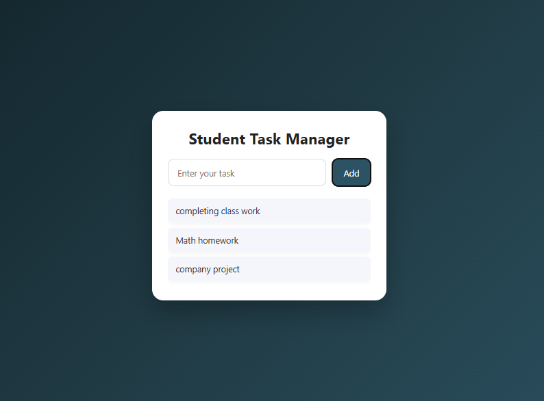
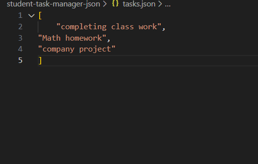

# 1. Project Title & Goal

Student Task Manager Website – A simple web application to add and view student homework tasks using local JSON storage.

# 2. Setup Instructions

The project runs locally on the system.
The backend server is started first, and the frontend webpage is opened in the browser to interact with the application.

# 3. The Logic (How you thought)

# Why did you choose this approach?
I followed the problem statement exactly by using a simple API, a basic HTML–JavaScript frontend, and a local JSON file for storage. This approach keeps the project lightweight and easy to understand.

# Hardest bug and solution
The main issue was that newly added tasks were not appearing instantly.
I fixed this by reloading the task list after each task addition so the updated data shows without refreshing the page.

# 4. Output Screenshots

# 5. Future Improvements

If given more time, I would:
Add delete and update task features
Improve UI design
Add task completion status
Add proper error handlin